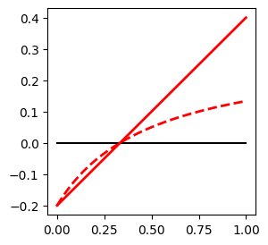

## Example: Functional Response Fitting

```python
import numpy as np
import matplotlib.pyplot as plt

plt.figure(figsize=(3,3))

R = np.arange(0,1,0.001)
attack = 1
handling = 2
mortality = 0.2

sat_GR = attack*R/(1+attack*handling*R) - mortality

# attack rate of the linearized functional response: (1-mortality*handling)*attack
# mortality rate: does not change
lin_GR = (1-mortality*handling)*attack*R - mortality

plt.plot(R, sat_GR, '--r', linewidth=2)
plt.plot(R, sat_GR*0, '-k')
plt.plot(R, lin_GR, '-r', linewidth=2)
plt.xlabel('Resource density')
plt.ylabel('Per capita growth rate')
plt.title('Functional response fitting')
plt.show()
```

